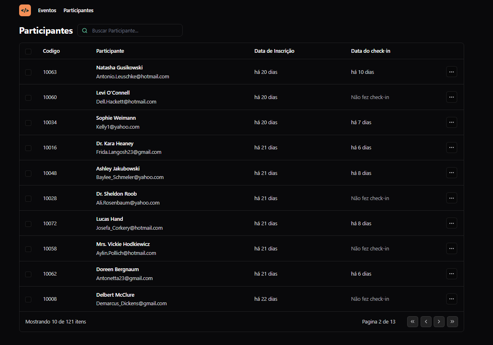

# NLW UNITE #15 - Pass.in

O pass.in  é um projeto de gestao de participação de eventos  vamos a criar a parte de participantes vamos a criar a parte  de gestão do evento usando react e tailwind 

## Sobre o Projeto 

Aplicação dos conceitos de 

- Propriedades
- Estados 
- Componentes 

Tipagem com Typescript, tooling com Vite, interface responsiva com TailwindCSS
Consumo de API Node.js, use de URL states

## Pré-Requisitos 📚

- Node.js versão v18 ou superior (usar a versão LTS)
- npm ou Yarn -  Versão 9.5.1 ou superior 
- Ter Instalado vscode ou o editor de codigo de preferencia 

## 🛠 Instalação 

1) Clone o Repositorio 
2) Instale as dependencias (npm install ou npm i )
3) Crie um arquivo de configuração Crie um arquivo .env, na raiz do projeto e configure as variáveis de ambiente necessárias.
4) Abra o terminal e digital npm run dev para inicializar o servidor 

## Variáveis de Ambiente

Para rodar esse projeto, você vai precisar adicionar as seguintes variáveis de ambiente no seu .env

`DATABASE_URL = “file:./dev.db”`

## Link da aplicação

👉🏼[Clique aqui para accessar](https://nlw-unite-15-pass-in.netlify.app/)

##  Tecnologias usadas no projeto

## 🔗 Deploy 

## 💻 Sobre mim 😄
 Estudante de Engenharia de Software na UNOPAR e 
 Desenvolvedor Front End estudando na Rocketseat do Programa Explorer 

## 🔗 Contato 

